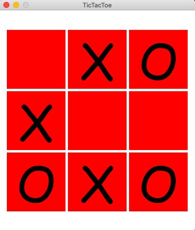

# TicTacToe 




<h1>Instructions </h1>

1. Make sure you have Python-3 installed and working 
2. Clone the repository on your machine by clicking in the command line: 
git clone ```https://github.com/tal-weisblat/Tetris.git```
3. Install prerequisites using pip (or pip3) 
4. Run <i>game.py</i> to run the application 


